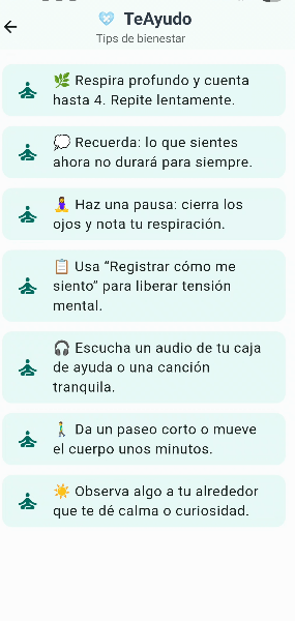
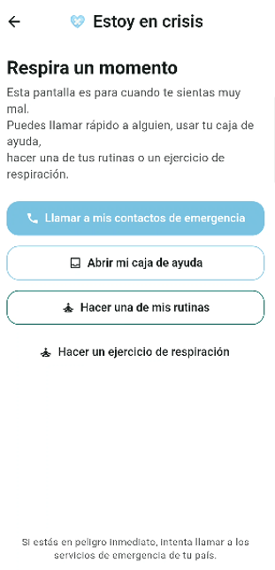

# TeAyudo - App móvil de apoyo emocional

## Descripción
TeAyudo es una aplicación móvil desarrollada en Flutter orientada a brindar apoyo inmediato y preventivo durante episodios de estrés, ansiedad o crisis emocional.

La aplicación permite al usuario acceder rápidamente a herramientas de regulación emocional, registrar su estado y contar con recursos de apoyo personalizados.

## Tecnologías utilizadas
- Flutter
- Dart
- Hive (almacenamiento local)
- Provider (gestión de estado)

## Funcionalidades
- Modo crisis con técnicas guiadas (respiración, grounding)
- Registro de emociones
- Rutinas preventivas
- Contactos de emergencia
- Historial de estados emocionales
- Caja de ayuda (contenido personalizado)

## Enfoque del diseño
- Interfaz simple e intuitiva
- Acceso rápido en situaciones críticas
- Uso offline
- Experiencia centrada en el usuario

## Capturas de la aplicación

### Pantalla principal

### Modo crisis

### Registro de emociones

## Autor
Valeria Cofré
